# Auto-Intelligent: AI 모델 훈련 자동화 파이프라인

우리는 일상에서 다양한 AI를 이용하며 많은 어렵고 힘든 일들의 자동화를 실현하고 있습니다.
하지만 정작 이러한 AI를 훈련하고 튜닝하는 과정에는 왜 인간의 노력이 필요할까요?

이 프로젝트는 게으른 개발자가 AI에 대해 공부하고 AI 모델을 훈련시키는 과정에서 “AI를 훈련해주는 AI는 없나?”, “버튼만 누르면 AI 모델이 뚝딱 만들어지면 좋겠다”라는 생각을 떠올리며 시작되었습니다.

입문자도 따라올 수 있도록 **CSV 업로드 → EDA → 전처리 → 특징공학 → 모델 비교 → HPO → 검증 → 리포트 → 인퍼런스**까지 전 과정을 안내하는 Streamlit 기반 프로젝트입니다. 본 문서는 프로젝트 실행 방법과 각 단계의 사용법을 상세히 설명합니다.

---

## 1. 프로젝트 개요
- **목적**: 초보자를 위한 직관적 ML 학습/실습 환경 제공 (데이터 파악 → 전처리 → 모델링 → 튜닝 → 예측).
- **특징**:
  - 업로드된 데이터를 기준으로 자동으로 train/test 분할 방식을 추천합니다 (random/stratified/time/group).
  - 타깃 특성을 기준으로 문제 유형을 classification 또는 regression으로 자동 분류합니다.
  - 데이터에 대한 상세한 통계와 다양한 시각화를 제공합니다.
  - 기본 전처리 파이프라인(결측 대치, 인코딩, 스케일링)을 수행합니다.
  - 속성 간 연산을 통해 새로운 속성을 생성하고, 중요도가 높은 속성을 추천·선택할 수 있습니다.
  - 베이스라인 비교 + Optuna/GridSearch HPO, 불균형 대응 샘플링 옵션을 제공합니다.
  - 훈련된 모델의 최종 검증 지표/중요도/SHAP(옵션)을 제공합니다.
  - 전체 과정에 대한 요약된 HTML 리포트를 제공합니다.
  - 완성된 모델로 다른 데이터 추론을 수행하거나, 모델을 내보낼 수 있습니다.
- **대상**: ML 입문자/학생
- **설계 방향**: 모듈형 구조로 유지보수·확장 용이하게 구성(EDA/전처리/HPO/인퍼런스 등 기능과 페이지가 분리된 `modules/`, `pages/` 구조)

---

## 2. 빠른 시작
### 요구사항
- Python 3.10+
- OS: Windows / macOS / Linux
- 필수 패키지: `streamlit`, `pandas`, `scikit-learn`, `plotly`, `optuna`, `imbalanced-learn` 등 (`requirements.txt` 참조)

### 설치 및 실행
```bash
python -m venv .venv
.venv\Scripts\activate  # macOS/Linux: source .venv/bin/activate
pip install -r requirements.txt
streamlit run app.py
```
브라우저가 열리면 좌측 사이드바의 01~10 단계를 순서대로 진행합니다.  
배포 버전(바로 실행): https://aai-lab.streamlit.app/

### 샘플 데이터
당장 사용 가능한 데이터가 없어도 괜찮습니다. 01 Upload 페이지에서 "샘플 데이터 로드" 버튼을 누르면 demo 데이터를 불러올 수 있습니다. 또는 Dacon/Kaggle 등에서 train.csv를 내려받아 사용할 수도 있습니다.

## 3. 아키텍처 & 디렉터리
```
app.py                 # 메인 진입점
pages/                 # Streamlit 페이지 (01~10)
modules/               # 전처리/특징공학/HPO/EDA 등 핵심 로직
reports/               # 생성된 HTML 리포트 저장
artifacts/             # 저장된 모델/파이프라인
requirements.txt       # 의존성
project_overview.md    # 추가 아키텍처 설명
```
**데이터 흐름**: Upload → Overview(분할/타깃) → EDA → Preprocessing → Feature Engineering → Model Selection → HPO → Validation → Report → Inference

---

## 4. 주요 기능 요약
- **자동 분할 추천**: 시계열/그룹/불균형 감지로 time/group/stratified/random 제안
- **전처리 파이프라인**: 수치/범주 결측 대치, One-Hot/Ordinal, 스케일링
- **특징공학**: 비율/차이/합/로그/시간 추출 자동 생성, 선택/교체, 중요도 기반 추천
- **모델 비교**: 교차검증 기반 베이스라인 실행 및 시각화
- **HPO**: Optuna(시간/조기중단), GridSearch 2단계(coarse→fine), 불균형 샘플링
- **검증**: 분류/회귀 지표, 혼동행렬·ROC/PR·Residual, 중요도, SHAP(옵션)
- **리포트**: HTML 단일 형식 생성(섹션 선택)
- **인퍼런스**: 학습 모델로 새 CSV 예측, Kaggle/Dacon 제출용 파일 및 모델 다운로드

---

## 5. 페이지별 안내
- **01 Upload**: CSV/샘플 업로드, 타깃 후보 확인, 기본 split 생성, 데이터 지문 보기
- **02 Overview**: 컬럼 메타/타입/드랍, 분할 전략 추천 및 재생성, 문제 유형 설정
- **03 EDA**: 자동 텍스트 요약, 타깃 분포, 단일 컬럼 플롯, 상관/결측, 선택적 pair plot
- **04 Preprocessing**: 결측 대치/인코딩/스케일링 설정, 미리보기 후 전처리 적용
- **05 Feature Engineering**: 규칙 기반 자동 생성, 선택/교체, 중요도 추천 및 적용
- **06 Model Selection**: CV 설정 후 베이스라인 실행, 결과 표/그래프, 모델 스냅샷/저장
- **07 HPO**: Optuna 및 GridSearch 튜닝, 시간 예산/조기중단, 샘플링 옵션, 베스트 파라미터 저장
- **08 Validation**: 선택 모델로 검증, 주요 지표/플롯, 중요도, SHAP(옵션), 결과 요약 저장
- **09 Report**: HTML 보고서 생성(데이터/특징/베이스라인/HPO/검증 섹션 선택)
- **10 Inference**: 학습 모델 선택 → 예측 옵션 → CSV 업로드 → 전체/제출용 파일 다운로드, 모델 피클 다운로드

---

## 6. 사용 흐름 예시 (10단계 스크린샷 템플릿)
_red → orange → yellow → green → blue → navy → purple_ 순서의 컬러 박스를 참고해 따라가면 됩니다.

### 0) 메인화면 & 서비스 개요  
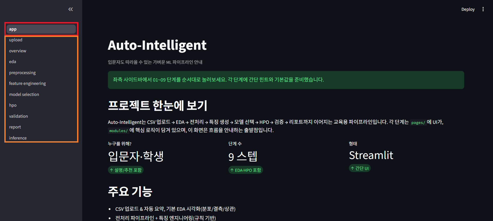  
- **r**: 메인 페이지입니다. 프로젝트 개요와 소개를 포함합니다.  
- **o**: 사이드바에서 각 단계로 이동할 수 있습니다.

### 1) 데이터 업로드  
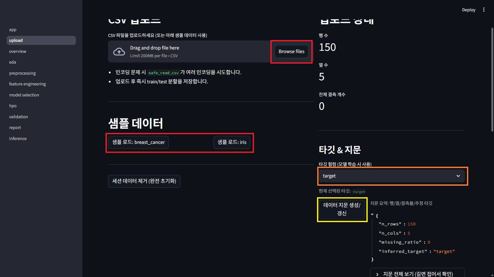  
- **r**: 사용할 csv 형식의 데이터를 직접 업로드 하거나, 샘플 데이터를 불러오세요.  
- **o**: 예측목표(target)를 지정하세요.  
- **y**: 데이터 지문을 생성하세요.

### 2) 데이터 개요 / 분할 전략 설정  
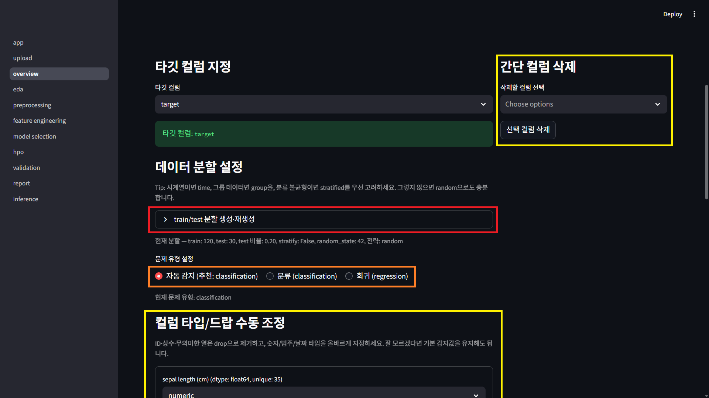  
- **r**: 데이터 형태에 따라 분할방식이 자동 추천됩니다. 필요시 직접 수정하여 데이터 세트 분할을 적용하세요.  
- **o**: 문제 유형은 데이터 형태에 따라 자동 감지됩니다. 필요시 직접 설정하세요.  
- **y**: 불필요하거나 의미 없는 컬럼을 제거하거나, 타입을 조정 할 수 있습니다.

### 3) EDA  
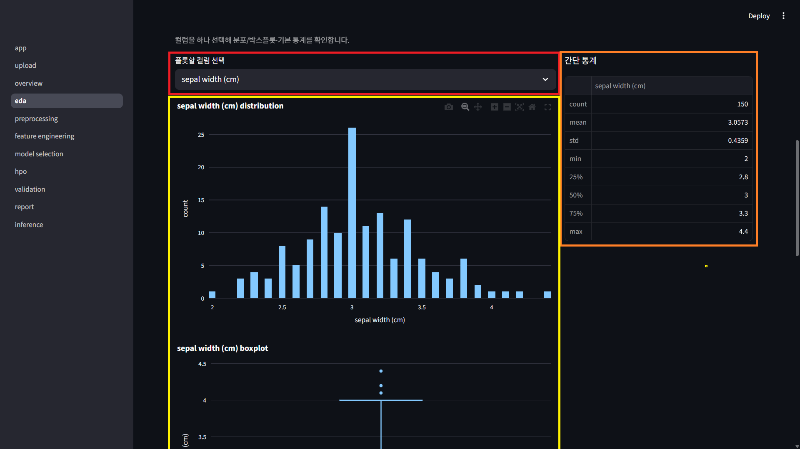  
- **r**: 시각화할 컬럼을 선택하세요.  
- **o**: 선택한 컬럼에 대한 수치적 통계를 확인하세요.  
- **y**: 선택할 컬럼을 시각화한 분포그래프와 박스플롯을 확인하세요.  
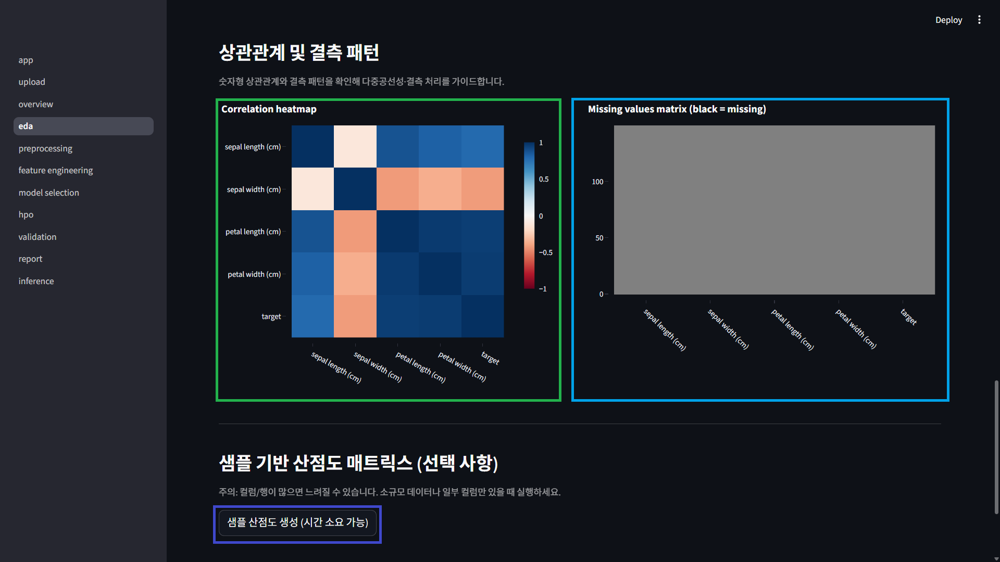  
- **g**: 상관관계 히트맵을 통해 컬럼간 관계를 확인하세요.  
- **b**: 각 컬럼별 결측치 분포를 빠르게 확인하세요.

### 4) 데이터 전처리  
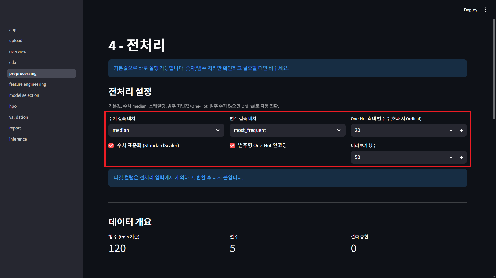  
- **r**: 데이터 전처리를 위한 결측치 처리 전략, 스케일링 적용 여부, 범주형 컬럼 처리 전략을 설정하세요.  
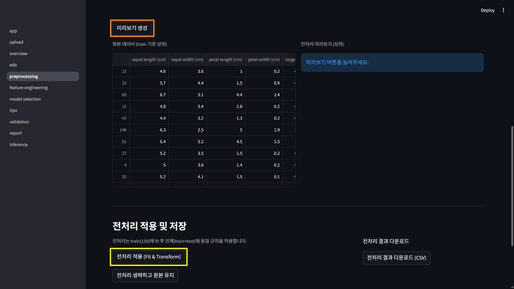  
- **o**: 전처리 후 데이터 미리보기를 확인할 수 있습니다.  
- **y**: 문제가 없다면, tarin 데이터 기반으로 fit 된 전처리 파이프라인을 전체 데이터에 적용하세요.

### 5) 특징공학  
  
- **r**: 새로운 속성을 생성하기 위해 생성할 속성의 최대 개수와 적용할 변환 방식을 선택합니다.  
- **o**: 버튼을 클릭하여 새로운 속성을 생성합니다.  
  
- **y**: 기존 속성과 새로운 속성을 모두 가져옵니다.  
- **g**: 속성 중요도를 기반으로 최종 선택할 속성의 최대 개수를 정합니다.  
- **b**: 중요도 기반 속성 추천을 시행합니다.  
- **n**: 추천된 속성을 최종적으로 채택합니다.

### 6) 베이스라인 모델 비교  
  
- **r**: 교차검증과 재현성을 위한 값을 설정합니다.  
- **o**: 기본 모델의 비교를 수행하여, 가장 우수한 모델을 자동 선택합니다.  
  
- **y**: 모델별 성능 지표를 확인합니다.  
- **g**: 필요시 특정 모델을 베이스 모델로 지정합니다.  
- **b**: 지정한 모델을 기본 베이스라인 모델로 지정합니다.

### 7) 하이퍼 파라미터 튜닝  
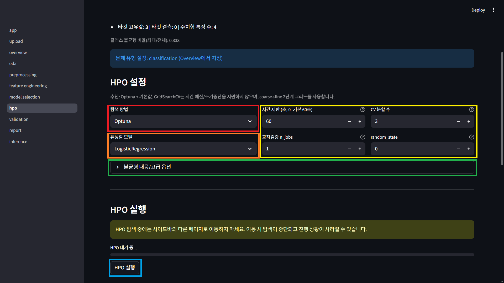  
- **r**: 하이퍼피라미터 튜닝 방식을 선택합니다.  
- **o**: 튜닝 대상 모델을 선택합니다.  
- **y**: 시간 예산과 교차검증, 병렬처리, 재현성 옵션을 설정합니다.  
- **g**: 샘플링 및 탐색 조기 중단 등 고급 옵션을 설정합니다.  
- **b**: 모델의 하이퍼피라미터 튜닝을 시작합니다. 튜닝 성공시 자동으로 가장 좋은 피라미터로 튜닝된 모델이 저장됩니다.

### 8) 모델 검증  
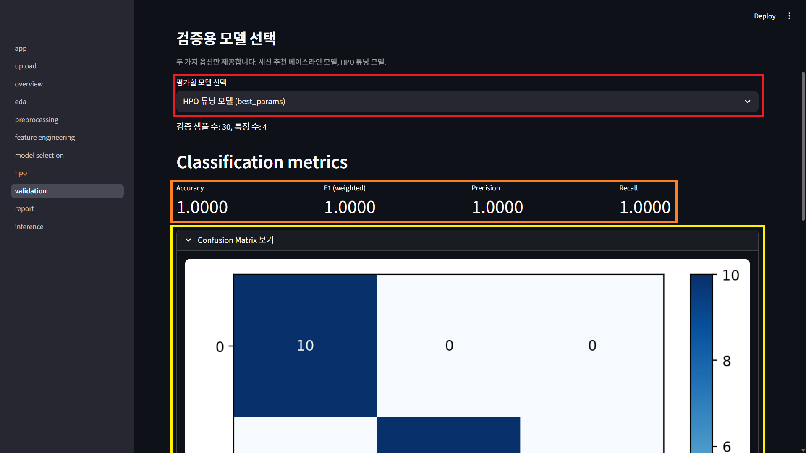  
- **r**: 검증할 모델을 선택합니다.  
- **o**: 모델에 대한 주요 평가 점수를 확인합니다.  
- **y**: confusion matrix 를 확인합니다.  
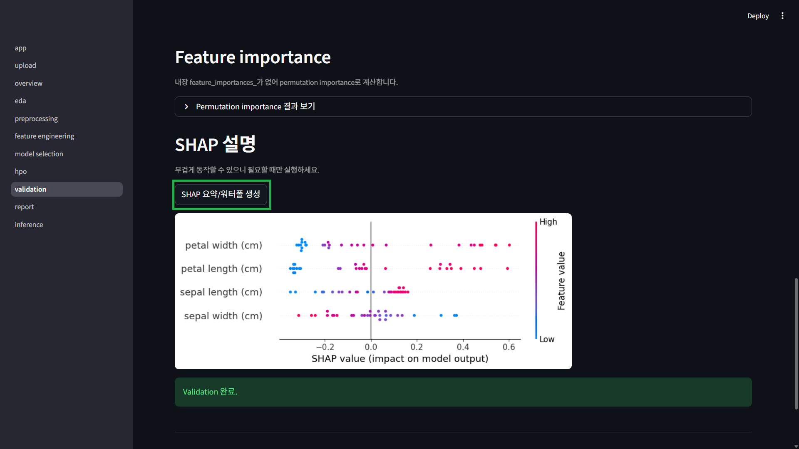  
- **g**: SHAP 요약 이미지를 생성합니다. 오래걸릴 수 있습니다. 각 속성의 기여와 중요도를 확인할 수 있습니다.

### 9) 데이터 및 모델 보고서 생성  
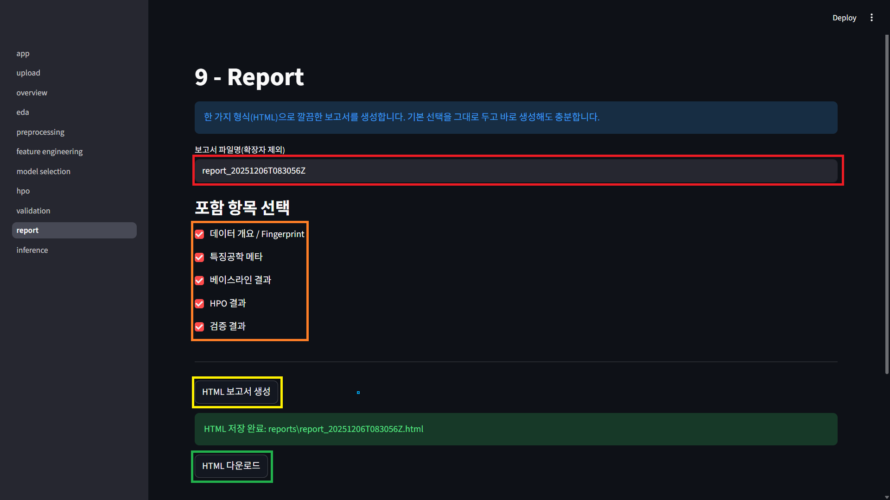  
- **r**: 보고서 파일 이름을 설정합니다.  
- **o**: 보고서에 포함될 내용을 선택합니다.  
- **y**: 보고서를 생성합니다. 시간이 걸릴 수 있습니다.  
- **g**: 생성된 보고서를 다운로드합니다.

### 10) 모델 활용 및 pkl 추출  
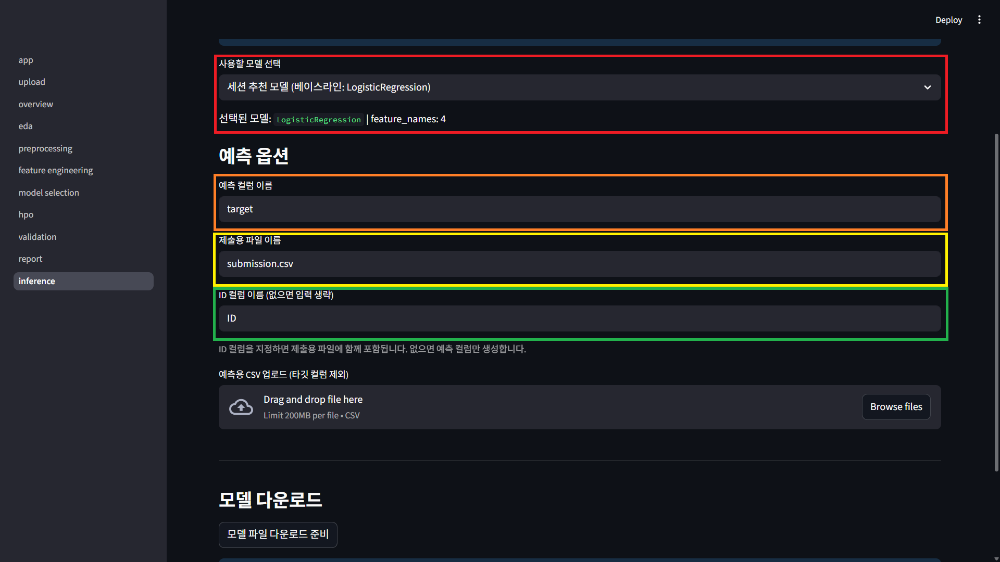  
- **r**: 사용할 모델을 선택합니다.  
- **o**: 예측 결과를 기록할 컬럼 이름을 지정합니다.  
- **y**: 최종 예측 결과 파일의 이름을 지정합니다.  
- **g**: 단순화된 최종 예측 결과 파일에 예측결과와 함께 포함할 식별용 ID 칼럼의 이름을 지정합니다.  
  
- **주의**: 이미지에서 사용된 데이터는 예측 예시를 보여주기 위해 Dacon의 영화 관객수 예측 프로젝트의 test.csv 샘플 데이터를 사용하였으며, 지금까지의 워크 플로우와 맞지 않습니다.  
- **b**: 예측을 위해 업로드된 데이터의 전체 컬럼 + 예측 결과 컬럼을 결합한 결과 csv를 생성하여 내보냅니다.  
- **n**: ID + 예측 결과 컬럼만 결합한 csv 파일을 내보냅니다.  
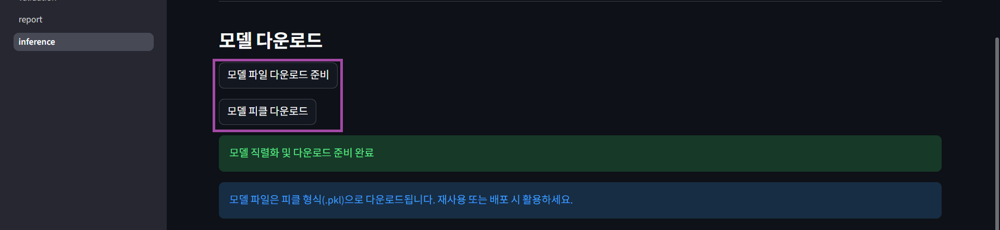  
- **p**: 모델을 바로 사용하는 대신, 선택한 모델을 pkl 형태로 내보냅니다.

---

## 7. 의존성 요약
- `streamlit`, `pandas`, `numpy`, `scikit-learn`, `plotly`, `optuna`, `imbalanced-learn`, `shap`(옵션), 기타 `modules/`에서 요구하는 패키지.  
전체 목록과 버전 범위는 `requirements.txt`를 따릅니다.

---

## 8. 라이선스
프로젝트 루트의 `LICENSE` 파일을 참고하세요.

## 9. 향후 개선 방향
- 큰 데이터셋을 위한 성능 최적화
- 완전 자동화 목표: 데이터 업로드만으로 분석→모델 생성→검증까지 전 과정 수행
- 고급 모델/파이프라인 추가: 시계열/멀티모달 대응, 추가 불균형 처리 기법, 앙상블·스태킹 옵션
- 범용성 확장: 분류/회귀 외에 클러스터링, 딥러닝(예: 이미지·텍스트), 강화학습 대응 파이프라인 설계
